<p align="center">
  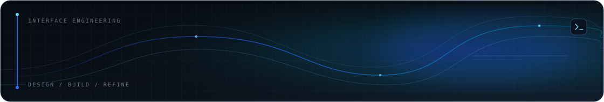
</p>

<h1 align="center">Hi, I'm Maruf Hossen</h1>

<p align="center">
  <strong>Front-End Developer · UI Engineer · Full-Stack Developer in Progress</strong>
</p>

<p align="center">
  I build modern web interfaces with a frontend-first mindset—bringing responsive design,
  component architecture, and practical user experience together. My strongest focus is
  UI implementation with HTML, CSS, JavaScript, TypeScript, and React. I also work with
  API integration and am steadily growing my Node.js, backend, database, and full-stack capabilities.
</p>

<p align="center">
  <a href="https://github.com/marufhossen-in">&nbsp;GitHub</a>
  &nbsp;·&nbsp;
  <a href="https://www.linkedin.com/in/marufhossen-in">&nbsp;LinkedIn</a>
  &nbsp;·&nbsp;
  <a href="https://brilliant-sunburst-9b3a0e.netlify.app/">&nbsp;Portfolio</a>
  &nbsp;·&nbsp;
  <a href="mailto:marufhossen.in@gmail.com">&nbsp;Email</a>
</p>

<p align="center">
  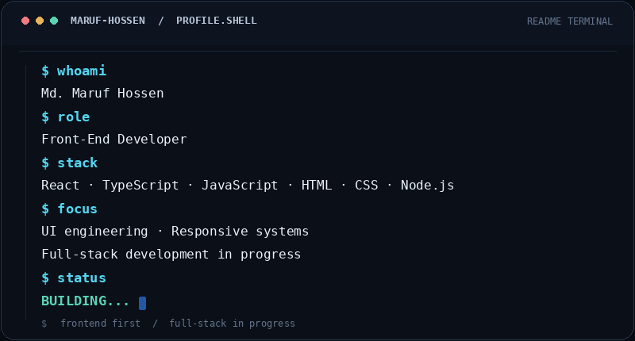
</p>

---

## QUICK PROFILE

| AREA | INFORMATION |
| --- | --- |
| Developer | Md. Maruf Hossen |
| Primary focus | Front-end development and UI engineering |
| Core languages | HTML5 · CSS3 · JavaScript · TypeScript |
| Front-end | React · responsive interfaces · component-based development |
| Back-end | Node.js · REST APIs — growing capability |
| Workflow | Git · GitHub · npm · VS Code |
| Exploring | Backend architecture · databases · full-stack · AI-powered web apps |

## TECHNOLOGY STACK

### Frontend

<p>
  &nbsp;HTML5&nbsp;&nbsp;
  &nbsp;CSS3&nbsp;&nbsp;
  &nbsp;JavaScript&nbsp;&nbsp;
  &nbsp;TypeScript&nbsp;&nbsp;
  &nbsp;React
</p>

### Backend

<p>
  &nbsp;Node.js&nbsp;&nbsp;
  &nbsp;REST APIs
  <span> — basic / intermediate experience, actively developing.</span>
</p>

### Development tools

<p>
  &nbsp;Git&nbsp;&nbsp;
  &nbsp;GitHub&nbsp;&nbsp;
  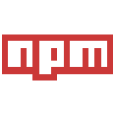&nbsp;npm&nbsp;&nbsp;
  &nbsp;VS Code
</p>

### Currently exploring

Backend architecture · database integration · full-stack development · AI integration.

<p align="center">
  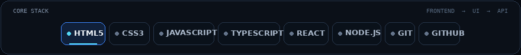
</p>

## WHAT I BUILD

<table>
  <tbody>
    <tr>
      <td><strong>Modern websites</strong><br />Responsive, polished experiences with clear visual hierarchy.</td>
      <td><strong>Web applications</strong><br />Interactive products built with modern front-end patterns.</td>
    </tr>
    <tr>
      <td><strong>SaaS interfaces</strong><br />Dashboards and product surfaces designed around real workflows.</td>
      <td><strong>Business websites</strong><br />Professional digital experiences for services and businesses.</td>
    </tr>
    <tr>
      <td><strong>Interactive experiences</strong><br />Useful motion and interface feedback that support the task.</td>
      <td><strong>Full-stack applications</strong><br />Front ends connected to APIs and backend services as my capabilities grow.</td>
    </tr>
    <tr>
      <td colspan="2"><strong>AI-powered interfaces</strong><br />Accessible product UIs for AI-assisted tools and workflows.</td>
    </tr>
  </tbody>
</table>

## FEATURED PROJECTS

The four demos below are real deployments. Project names and summaries are taken from the live sites and their public source repositories; these are frontend projects, not claims of production backend services.

### `01 / AI & SaaS` — VectorPilot

<p>
  <a href="https://merry-basbousa-3ed9d0.netlify.app/">
    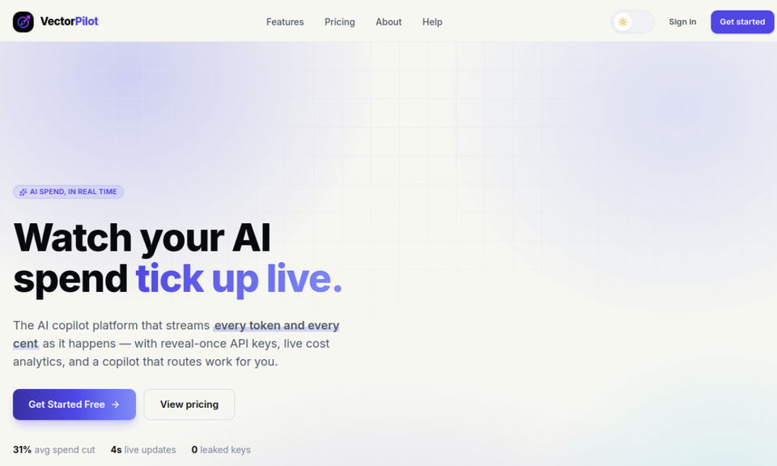
  </a>
</p>

A product UI for AI-operations workflows, including spend analytics, a copilot workspace, session history, and API-key management. The repository describes a frontend-only demo; AI services, billing, and server-side key storage are not implemented.

**Technology:** React 19 · TypeScript 5.9 · Vite 7 · Tailwind CSS v4 · React Router · GSAP  
**Links:** [Live demo ↗](https://merry-basbousa-3ed9d0.netlify.app/) · [Source code ↗](https://github.com/marufhossen-in/vectorpilot-frontend)

### `02 / Healthcare` — Medora

<p>
  <a href="https://scintillating-heliotrope-c5de50.netlify.app/">
    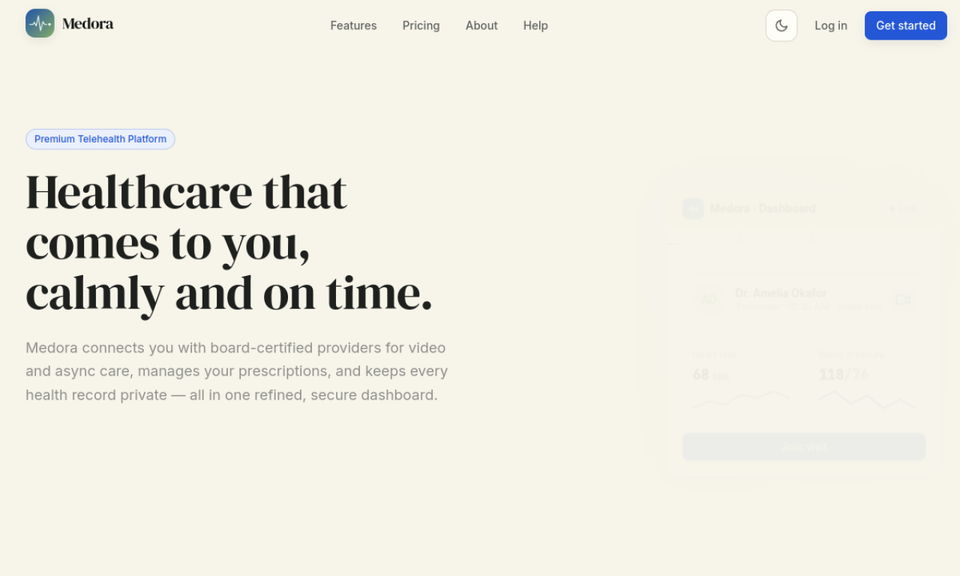
  </a>
</p>

A calm telehealth interface for provider discovery, visit scheduling, prescriptions, and patient-record experiences. It is a mock-first frontend; it does not represent a live healthcare service.

**Technology:** React 19 · TypeScript 5.9 · Vite 7 · Tailwind CSS v4 · TanStack Query · Zustand · GSAP · Framer Motion  
**Links:** [Live demo ↗](https://scintillating-heliotrope-c5de50.netlify.app/) · [Source code ↗](https://github.com/marufhossen-in/medora-healthcare-frontend)

### `03 / Logistics` — FleetAxis

<p>
  <a href="https://deft-crisp-2d7ac4.netlify.app/">
    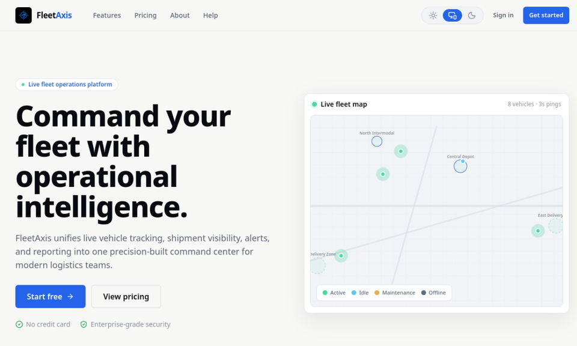
  </a>
</p>

A logistics command-center frontend for fleet visibility, shipment tracking, operational alerts, and driver workflows. Its public repository marks the project as frontend-only; live GPS ingestion and backend services are out of scope.

**Technology:** React 19 · TypeScript 5.9 · Vite 7 · Tailwind CSS v4 · React Router · GSAP  
**Links:** [Live demo ↗](https://deft-crisp-2d7ac4.netlify.app/) · [Source code ↗](https://github.com/marufhossen-in/fleetaxis-logistics-frontend)

### `04 / Real Estate` — Civella

<p>
  <a href="https://bright-smakager-89a790.netlify.app/">
    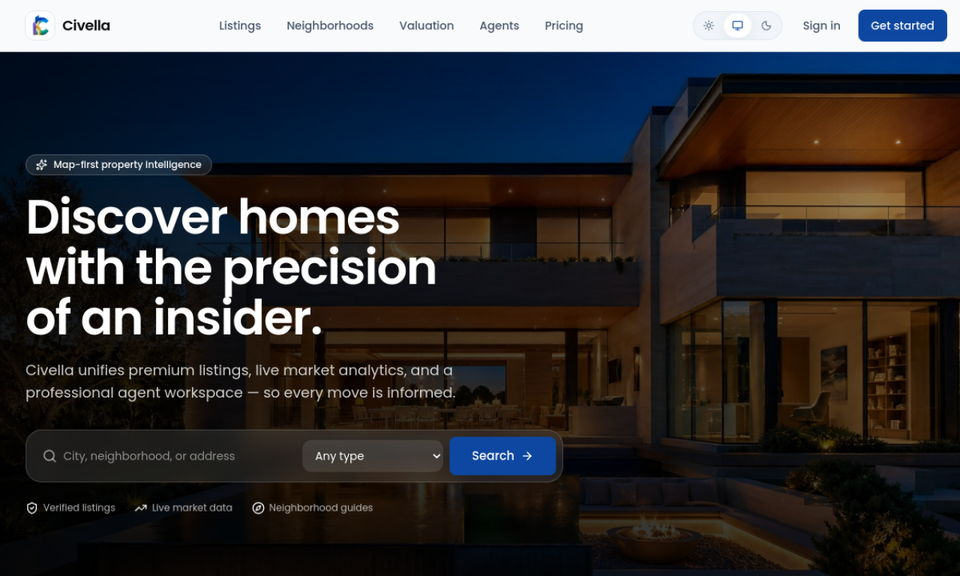
  </a>
</p>

A property-discovery interface with listings, market signals, neighborhood pages, and an agent workspace. The source repository describes a frontend-only, mock-ready experience with an API swap point.

**Technology:** React 19 · TypeScript 5.9 · Vite 7 · Tailwind CSS v4 · GSAP · Three.js  
**Links:** [Live demo ↗](https://bright-smakager-89a790.netlify.app/) · [Source code ↗](https://github.com/marufhossen-in/civella-portfolio)

## GITHUB ACTIVITY

Contribution and profile cards below are generated from Maruf's actual GitHub data and stored in this repository, rather than fetched from a shared third-party card server at page load. A repository-owned GitHub Actions workflow refreshes the SVGs daily; if an API run is delayed, the last successful snapshot remains available.

<p align="center">
  <a href="https://github.com/marufhossen-in">
    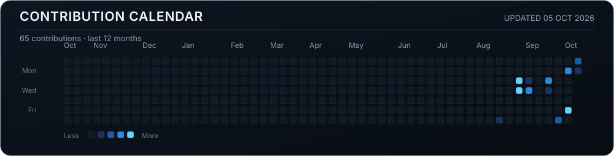
  </a>
</p>

<p align="center">
  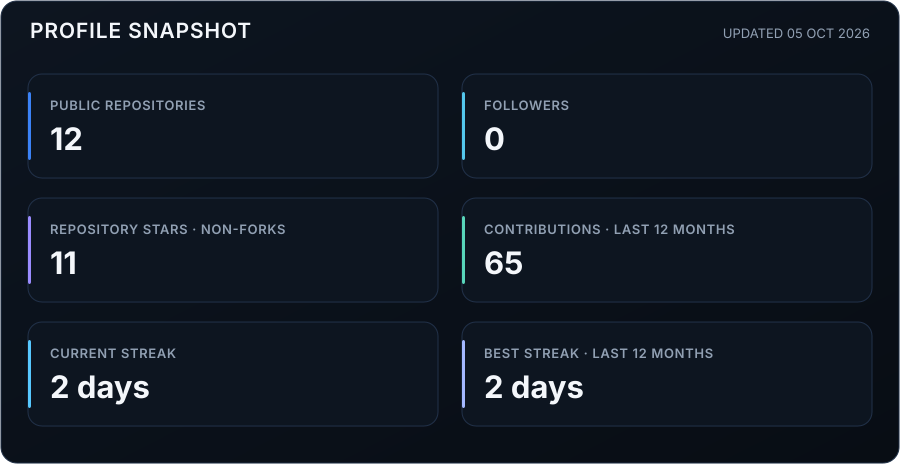
</p>

<p align="center">
  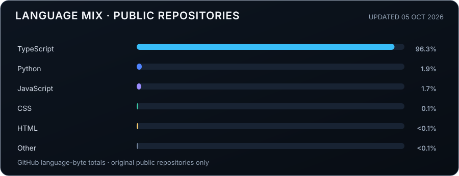
</p>

[View the full GitHub profile and native contribution calendar ↗](https://github.com/marufhossen-in)

## CURRENTLY BUILDING

Current areas of focus—not a claim that each is a separately released product:

- Modern React interfaces with stronger component boundaries
- TypeScript-based, responsive front-end systems
- API-connected application flows
- Full-stack experiments and AI-powered web concepts

## CURRENTLY LEARNING

- Advanced React patterns and application architecture
- TypeScript architecture and maintainable types
- Node.js and REST API development
- Database integration
- Full-stack development
- AI-powered web applications

## DEVELOPMENT ROADMAP

```text
FRONTEND
   ↓
ADVANCED FRONTEND
   ↓
BACKEND & API DESIGN
   ↓
DATABASE INTEGRATION
   ↓
FULL-STACK APPLICATIONS
   ↓
AI-POWERED WEB APPLICATIONS
```

## HOW I BUILD

| PRINCIPLE | PRACTICE |
| --- | --- |
| **01 — User-first interfaces** | Make the next action and information hierarchy clear. |
| **02 — Clean component architecture** | Keep UI pieces reusable and responsibilities understandable. |
| **03 — Responsive by default** | Design for narrow screens as well as desktop. |
| **04 — Performance matters** | Keep pages and assets purposeful and lightweight. |
| **05 — Maintainable code** | Prefer readable structure and predictable patterns. |
| **06 — Continuous learning** | Improve through deliberate practice and review. |
| **07 — Build real products** | Solve a defined user problem instead of polishing empty UI. |

## DEVELOPMENT WORKFLOW

<p align="center">
  <strong>IDEA</strong> &nbsp;→&nbsp; <strong>DESIGN</strong> &nbsp;→&nbsp; <strong>DEVELOP</strong> &nbsp;→&nbsp;
  <strong>TEST</strong> &nbsp;→&nbsp; <strong>OPTIMIZE</strong> &nbsp;→&nbsp; <strong>DEPLOY</strong> &nbsp;→&nbsp; <strong>ITERATE</strong>
</p>

## SELECTED REPOSITORIES

A curated source index for the four featured front-end projects:

- [**vectorpilot-frontend**](https://github.com/marufhossen-in/vectorpilot-frontend) — AI-operations SaaS frontend · React · TypeScript.
- [**medora-healthcare-frontend**](https://github.com/marufhossen-in/medora-healthcare-frontend) — telehealth product UI · React · TypeScript.
- [**fleetaxis-logistics-frontend**](https://github.com/marufhossen-in/fleetaxis-logistics-frontend) — fleet and shipment operations frontend · React · TypeScript.
- [**civella-portfolio**](https://github.com/marufhossen-in/civella-portfolio) — property discovery and agent workspace · React · TypeScript · Three.js.

## LET'S CONNECT

<p>
  <a href="https://github.com/marufhossen-in">&nbsp;GitHub</a><br />
  <a href="https://www.linkedin.com/in/marufhossen-in">&nbsp;LinkedIn</a><br />
  <a href="https://brilliant-sunburst-9b3a0e.netlify.app/">&nbsp;Portfolio</a><br />
  <a href="mailto:marufhossen.in@gmail.com">&nbsp;Email</a><br />
  &nbsp;WhatsApp — link to be added when available.
</p>

<p align="center">
  <sub>Md. Maruf Hossen · Front-end first, full-stack in progress · Built with real projects and honest metrics.</sub>
</p>
